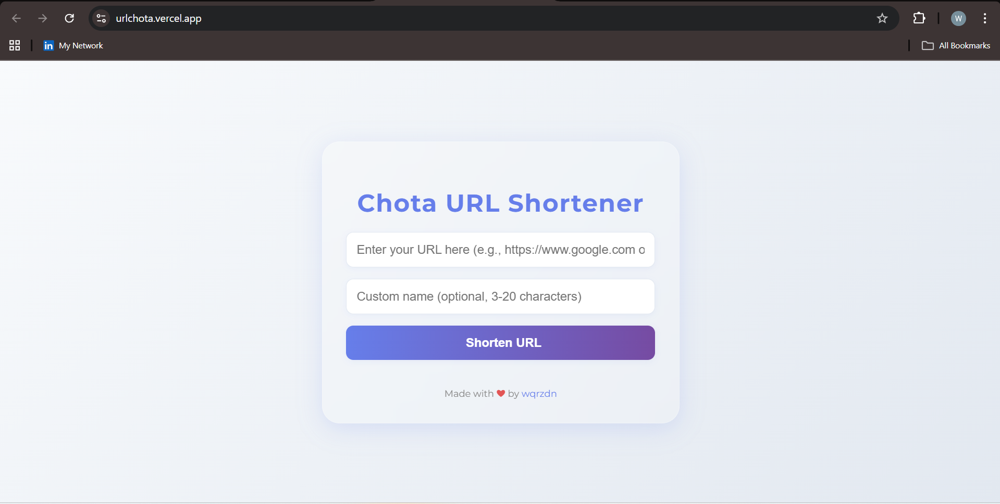

# Chota URL Shortener 

A modern, full-stack URL shortener built in Go.  
I created this project to learn Go, explore backend development, and build something useful from scratch.

## Why I Built This

> **This project was my hands-on journey to learn Go (Golang).**  
> I wanted to understand Go’s concurrency, web server capabilities, and how to build scalable backend services.  
> Everything here from the Redis integration to the custom handlers was written to deepen my understanding of Go.

## Features

-  Shorten any long URL to a compact, shareable link
-  Fast redirects to original URLs
-  Persistent storage using Redis
-  Beautiful, responsive frontend (HTML/CSS/JS)
-  Secure, random short codes
-  Ready for cloud deployment (Vercel, etc.)

## Tech Stack

- **Backend:** Go (Golang)
- **Frontend:** HTML, CSS, JavaScript
- **Database:** Redis
- **Deployment:** Vercel (cloud-ready)

## How It Works

1. Paste a long URL into the form.
2. Get a short link (e.g., `/abc123`).
3. Share the link—anyone visiting it gets redirected instantly.

## Getting Started

```sh
# Clone the repo
git clone https://github.com/wqrzdn/ChotaURL-1_public
cd ChotaURL-1_public

# Install dependencies
go mod tidy

# Run locally
go run main.go
```

Open [http://localhost:3000](http://localhost:3000) in your browser.

## Demo

 

## Live Demo

 [View the live app here](https://urlchota.vercel.app/) 

## What I Learned

- Go’s web server and handler patterns
- Using Redis for fast, persistent storage
- Building RESTful APIs and custom middleware
- Frontend integration with backend APIs
- Cloud deployment best practices
